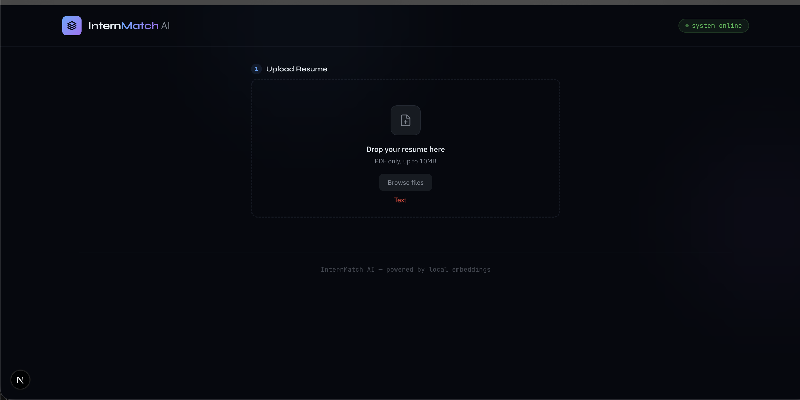
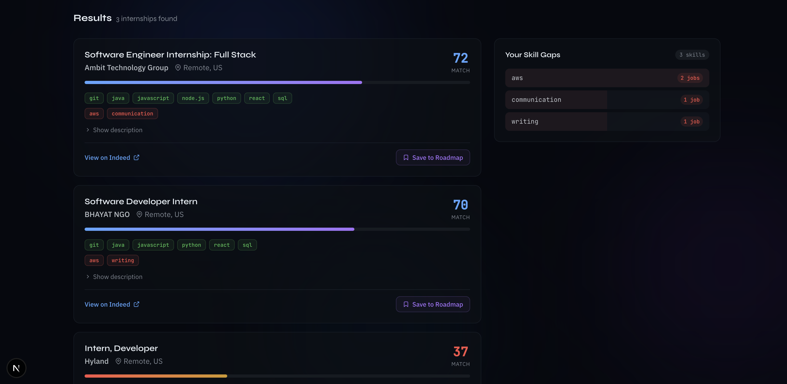
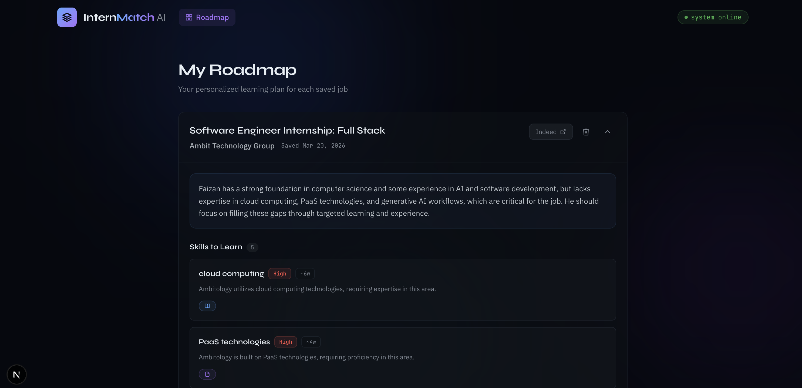

# 🧠 AI Resume Matcher

An AI-powered system that matches your resume to real internships and generates a personalized roadmap to close your skill gaps — fully local, no API keys.

💡 Features

  📄 Upload PDF resume & extract skills

  🔎 Scrape real jobs (Indeed, ZipRecruiter, Glassdoor)

  🧠 Semantic matching using embeddings + FAISS

  📊 Match score + matched & missing skills

  🧭 AI-generated roadmap using Llama 3.1 8B

  🔐 100% local (runs via Ollama)
  

📸 Screenshots

Home

Results

Roadmap

🧩 Usage

  Upload your resume (PDF)

  Search for internships

  View ranked jobs with match scores

  Analyze missing skills

  Generate a roadmap for any job

  Track and manage saved roadmaps
  

🛠 Tech Stack

  Python 3.11+

  FastAPI — Backend

  Next.js + Tailwind CSS — Frontend

  Llama 3.1 (Ollama) — LLM

  nomic-embed-text — Embeddings

  FAISS — Vector search

  python-jobspy — Job scraping

  pdfplumber — PDF parsing

  SQLite — Database
